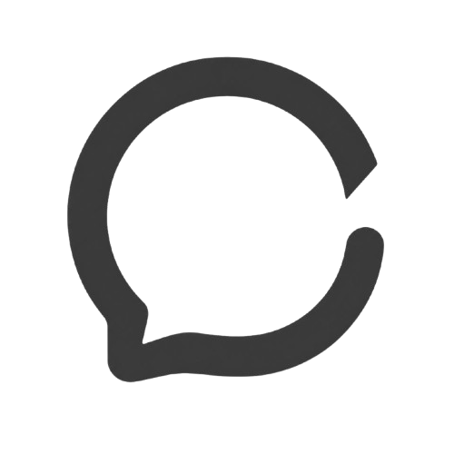

<p align="center">
  
</p>

<h1 align="center">Open Chat</h1>

<p align="center">
  One workspace for the AI agents already on your machine.
</p>

<p align="center">
  Connect Codex, Claude Code, OpenCode, Pi, ACP agents, and OpenAI-compatible models through one local-first interface.
</p>

Open Chat is an open AI CLI workspace. It gives different coding agents a shared conversation surface while keeping their native runtimes, permissions, models, and project context intact.

The goal is simple: **make the chat surface open, while the agent remains yours.** Open Chat does not replace the tools you already use. It connects them through native transports and the [Agent Client Protocol (ACP)](https://agentclientprotocol.com/), then presents their events in one consistent UI.

## Why Open Chat

- **Bring your own agents.** Use the CLI tools installed on your machine instead of moving projects into a vendor-specific cloud.
- **One conversation surface.** Switch agents, models, projects, and sessions without changing the way you work.
- **Native where possible.** Codex, Claude Code, Pi, and OpenCode run through their supported local protocols; custom agents can use ACP.
- **Local-first by default.** Conversation history is stored in the browser's IndexedDB. The server is a local compatibility gateway, not a hosted data store.
- **A normalized event stream.** Text, thoughts, plans, tool calls, usage, and permission requests become one set of UI events.

## How it fits together

```text
                 native CLI protocols
        Codex  ─────────────────────────┐
   Claude Code  ────────────────────────┤
          Pi  ──────────────────────────┤
     OpenCode  ──────────────────────────┤
        ACP agents  ─────────────────────┘
                           │
                           ▼
                 Open Chat local gateway
                           │ SSE / HTTP
                           ▼
                    Open Chat workspace
```

The gateway keeps provider-specific details at the edge. The website can therefore render a single workflow for conversations, streaming responses, tool activity, plans, files, model selection, and permissions.

See [docs/architecture.md](docs/architecture.md) for the canonical transcript contract, UI composition, provider adapter boundaries, and extension rules.

## Supported connections

| Connection            | Required command | Transport                         |
| --------------------- | ---------------- | --------------------------------- |
| Codex                 | `codex`          | app-server JSON-RPC               |
| Claude Code           | `claude`         | native `stream-json` stdin/stdout |
| Pi                    | `pi`             | RPC stdin/stdout                  |
| Oh My Pi              | `omp`            | RPC stdin/stdout (Pi-compatible)  |
| OpenCode              | `opencode`       | local HTTP + SSE                  |
| Custom ACP agent      | your executable  | Agent Client Protocol             |
| OpenAI-compatible API | provider URL     | HTTP streaming                    |

No separate `codex-acp`, `claude-code-acp`, or `pi-acp` installation is required. Open Chat discovers commands on the inherited `PATH` and common Homebrew, `~/.local/bin`, Bun, Cargo, mise, and Volta locations. Override a command or working directory with `[[acp.agents]]` in the server configuration.

## Quick start

Open Chat requires Node.js `>=22.12.0` and uses Vite+ for the toolchain.

```bash
vp install
```

Start the workspace with a single command:

```bash
pnpm open-chat
```

`open-chat` starts the local gateway, serves the pre-built UI from the same
port, opens your browser at `http://127.0.0.1:8082`, and stops cleanly on
`Ctrl+C`. It is a purely local tool — nothing is deployed to a server.

First run notes:

- **No configuration file — nothing to set up.** The gateway runs on built-in
  defaults and auto-discovers the CLI agents installed on your machine: codex /
  claude / pi / opencode / omp (Oh My Pi). Commands are found on `PATH`,
  `~/.local/bin`, mise shims, Homebrew, and other common locations; anything
  not installed simply shows up as unavailable in the UI.
- If the UI has not been built yet, run `pnpm open-chat --build` (builds the
  website and the CLI bundle) and start again.

CLI reference:

```text
pnpm open-chat                  # build-free start (tsx fallback) or bundled CLI
pnpm open-chat --build          # build website + CLI bundle, then exit
pnpm open-chat --dev            # dev mode: Vite dev server on :3000 + gateway
pnpm open-chat --no-open        # do not auto-open the browser
pnpm open-chat --port 0         # auto-assign an available port
pnpm open-chat --host 0.0.0.0   # listen on all interfaces
```

To expose `open-chat` as a global command from the source checkout (macOS/Linux):

```bash
pnpm build
cd tools/open-chat && pnpm link
open-chat
```

For an npm installation that works without the source checkout:

```bash
npm install -g @cc-heart/open-chat
open-chat
```

### Development mode

For development with hot reload, run the website and gateway separately:

```bash
vp run dev
```

- Website: http://localhost:3000
- Gateway: http://127.0.0.1:8082
- Health check: http://127.0.0.1:8082/health

The website development server proxies `/api` requests to the gateway.

## API surface

The gateway exposes provider-neutral endpoints for the workspace UI:

- `GET /api/acp/agents` lists configured agents and their `installed` / `available` status.
- `GET /api/acp/sessions?agentId=codex` lists the gateway's in-memory session mappings. Open Chat-started running turns include `running: true`, `startedAt`, their browser `conversationId`, and the provider `sessionId`; the website polls this endpoint to render sidebar status.
- `GET /api/acp/session?agentId=codex&conversationId=...` creates or reuses a native or ACP session and returns its modes, configuration options, history, and `running` state.
- `GET /api/acp/session/stream?agentId=codex&conversationId=...` subscribes to an Open Chat-started running session over SSE. The stream emits a snapshot, replays already buffered frames, then emits live frames, so another tab or a refreshed page can keep watching the turn.
- `POST /api/acp/session/cancel` stops an Open Chat-started running turn, including native CLI and ACP agents.
- `POST /api/acp/session/config` updates a session option, such as the selected model.
- `POST /api/chat/completions` starts an OpenAI-compatible or local-agent request and can stream normalized events over SSE.
- `POST /api/chat/permission` resolves permission requests from legacy OpenCode, native CLI, and ACP sessions.

Example local-agent request:

```json
{
  "acpAgentId": "codex",
  "conversationId": "browser-conversation-id",
  "messages": [{ "role": "user", "content": "Inspect this repository" }],
  "stream": true
}
```

For local agents, renderable output is sent as ordered `native_event` frames
(`content.delta`, `reasoning.delta`, `activity.upsert`, `plan.updated`, and
turn completion/failure). Session metadata, permissions, notices, and ACP
usage remain separate control events.

### Running session behavior

The web UI periodically refreshes both the active provider's session directory and gateway-owned run state. It polls every two seconds while any task is running and every five seconds while idle. Every running item in the active provider's conversation list shows a loading indicator and elapsed duration. Opening such an item loads its cached/provider history and attaches to the replayable session stream. Turns started through Open Chat are rendered from ordered native events; provider history is used only for loading persisted sessions. Reading or switching sessions does not update their timestamps, so the sidebar order remains stable.

Gateway-owned `running` state still applies only to turns started through Open Chat while the same gateway process remains alive. Direct terminal sessions can be loaded from provider history, but their raw PTY/TUI output is not reinterpreted as a live Web stream.

## Session deep links

Every open conversation is reflected in the address bar:

```text
/chat/{agentId}/{sessionId}
```

- `agentId` is the provider (for example `api`, `codex`, `opencode`, `pi`).
- `sessionId` is the provider session id when the agent exposes one (ACP / local CLI), otherwise the local conversation key.

Copy the address (or use the **link icon** in the header) and open it later, on any machine with the same provider configured: Open Chat switches to that provider and restores the matching session, including provider-side history for ACP agents. The sidebar's **New task** / agent / model switches keep the URL in sync, and browser back / forward navigates conversations.

## Development commands

```bash
vp run dev              # website + gateway (hot reload)
pnpm open-chat --dev    # CLI-managed dev mode (Vite on :3000 + gateway)
pnpm open-chat          # production mode: gateway serves the built UI
pnpm open-chat --build  # build website + CLI bundle
vp run website#dev      # website only
vp run server#dev       # gateway only
vp check                # format, lint, and type checks
vp run server#build
vp run website#build
vp run @cc-heart/open-chat#build
```

## Repository layout

```text
apps/website       Vue 3 + Antdv Next X workspace UI (built to dist/)
apps/server        Express gateway, native CLI adapters, ACP manager, API proxy
apps/server/src/transcript  canonical transcript contract, adapters, and SSE serialization
docs               architecture and UI ownership documentation
apps/server/src/app.ts      reusable gateway entry (createGatewayApp / startGateway)
tools/open-chat    open-chat CLI: starts gateway + serves UI + opens browser
```

## Project direction

Open Chat is intentionally built around interoperability rather than a fixed model catalog. The long-term direction is to make agent capabilities portable: a conversation should be able to move between local tools without losing context, structured activity, or user control.

That means the project prioritizes:

1. Open protocols and provider adapters over provider-specific UI.
2. Local execution, explicit permissions, and inspectable state.
3. A stable event contract that makes new agents feel native in the workspace.
4. Small, composable integrations that can be added without rewriting the chat surface.

## License

Open Chat is currently an experimental project. Licensing and contribution guidelines will be published as the project moves toward a stable public release.
