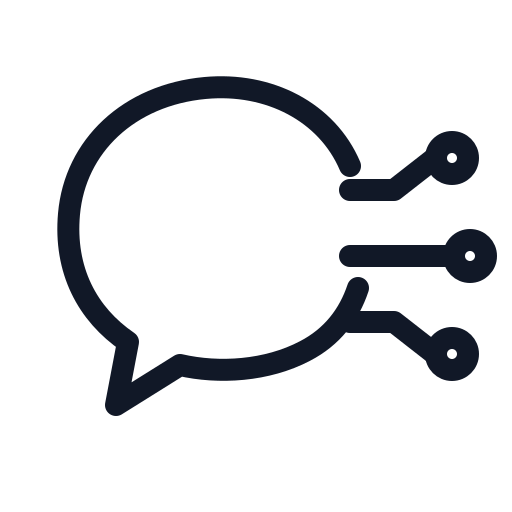

<p align="center">
  
</p>

<h1 align="center">Open Chat</h1>

<p align="center">
  One workspace for the AI agents already on your machine.
</p>

<p align="center">
  Connect Codex, Claude Code, OpenCode, Pi, ACP agents, and OpenAI-compatible models through one local-first interface.
</p>

Open Chat is an open AI CLI workspace. It gives different coding agents a shared conversation surface while keeping their native runtimes, permissions, models, and project context intact.

The goal is simple: **make the chat surface open, while the agent remains yours.** Open Chat does not replace the tools you already use. It connects them through native transports and the [Agent Client Protocol (ACP)](https://agentclientprotocol.com/), then presents their events in one consistent UI.

## Why Open Chat

- **Bring your own agents.** Use the CLI tools installed on your machine instead of moving projects into a vendor-specific cloud.
- **One conversation surface.** Switch agents, models, projects, and sessions without changing the way you work.
- **Native where possible.** Codex, Claude Code, Pi, and OpenCode run through their supported local protocols; custom agents can use ACP.
- **Local-first by default.** Conversation history is stored in the browser's IndexedDB. The server is a local compatibility gateway, not a hosted data store.
- **A normalized event stream.** Text, thoughts, plans, tool calls, usage, and permission requests become one set of UI events.

## How it fits together

```text
                 native CLI protocols
        Codex  ─────────────────────────┐
   Claude Code  ────────────────────────┤
          Pi  ──────────────────────────┤
     OpenCode  ──────────────────────────┤
        ACP agents  ─────────────────────┘
                           │
                           ▼
                 Open Chat local gateway
                           │ SSE / HTTP
                           ▼
                    Open Chat workspace
```

The gateway keeps provider-specific details at the edge. The website can therefore render a single workflow for conversations, streaming responses, tool activity, plans, files, model selection, and permissions.

## Supported connections

| Connection            | Required command | Transport                         |
| --------------------- | ---------------- | --------------------------------- |
| Codex                 | `codex`          | app-server JSON-RPC               |
| Claude Code           | `claude`         | native `stream-json` stdin/stdout |
| Pi                    | `pi`             | RPC stdin/stdout                  |
| OpenCode              | `opencode`       | local HTTP + SSE                  |
| Custom ACP agent      | your executable  | Agent Client Protocol             |
| OpenAI-compatible API | provider URL     | HTTP streaming                    |

No separate `codex-acp`, `claude-code-acp`, or `pi-acp` installation is required. Open Chat discovers commands on the inherited `PATH` and common Homebrew, `~/.local/bin`, Bun, Cargo, mise, and Volta locations. Override a command or working directory with `[[acp.agents]]` in the server configuration.

## Quick start

Open Chat requires Node.js `>=22.12.0` and uses Vite+ for the toolchain.

```bash
vp install
```

Create `apps/server/config/providers.toml` from the example file:

```bash
cp apps/server/config/providers.example.toml apps/server/config/providers.toml
```

For a minimal local setup, enable ACP in `providers.toml`:

```toml
bind_addr = "127.0.0.1:8082"
cors_allowed_origins = ["http://localhost:3000"]

[local]
enabled = false

[acp]
enabled = true
permission_timeout_ms = 300000
```

Start the website and gateway together:

```bash
vp run dev
```

- Website: http://localhost:3000
- Gateway: http://127.0.0.1:8082
- Health check: http://127.0.0.1:8082/health

The website development server proxies `/api` requests to the gateway.

## API surface

The gateway exposes provider-neutral endpoints for the workspace UI:

- `GET /api/acp/agents` lists configured agents and their `installed` / `available` status.
- `GET /api/acp/sessions?agentId=codex` lists active in-memory session mappings.
- `GET /api/acp/session?agentId=codex&conversationId=...` creates or reuses a native or ACP session and returns its modes and configuration options.
- `POST /api/acp/session/config` updates a session option, such as the selected model.
- `POST /api/chat/completions` starts an OpenAI-compatible or local-agent request and can stream normalized events over SSE.
- `POST /api/chat/permission` resolves permission requests from legacy OpenCode, native CLI, and ACP sessions.

Example local-agent request:

```json
{
  "acpAgentId": "codex",
  "conversationId": "browser-conversation-id",
  "messages": [{ "role": "user", "content": "Inspect this repository" }],
  "stream": true
}
```

In addition to normal assistant chunks, the SSE stream can carry `tool_call`, `acp_plan`, `acp_session`, `acp_turn`, and `chat_permission` events.

## Development commands

```bash
vp run dev              # website + gateway
vp run website#dev      # website only
vp run server#dev       # gateway only
vp check                # format, lint, and type checks
vp run server#build
vp run website#build
```

## Repository layout

```text
apps/website    Vue 3 + Antdv Next X workspace UI
apps/server     Express gateway, native CLI adapters, ACP manager, and API proxy
```

## Project direction

Open Chat is intentionally built around interoperability rather than a fixed model catalog. The long-term direction is to make agent capabilities portable: a conversation should be able to move between local tools without losing context, structured activity, or user control.

That means the project prioritizes:

1. Open protocols and provider adapters over provider-specific UI.
2. Local execution, explicit permissions, and inspectable state.
3. A stable event contract that makes new agents feel native in the workspace.
4. Small, composable integrations that can be added without rewriting the chat surface.

## License

Open Chat is currently an experimental project. Licensing and contribution guidelines will be published as the project moves toward a stable public release.
